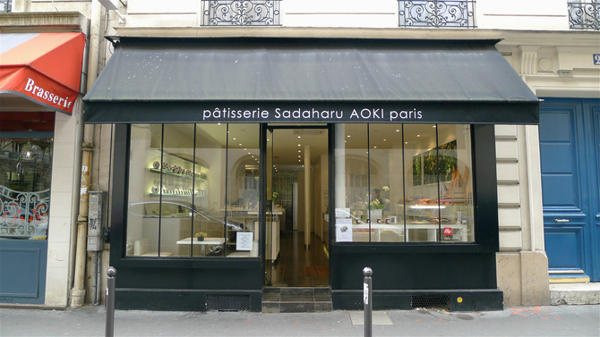
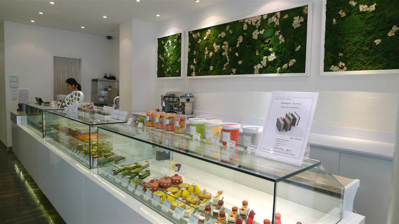
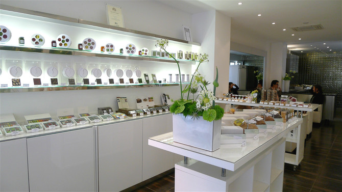
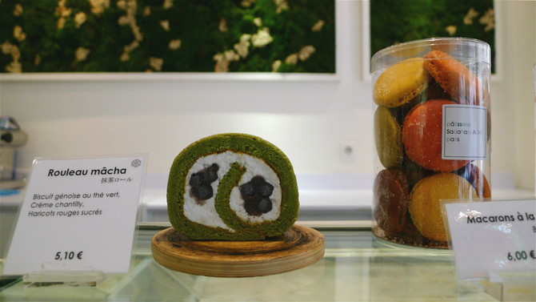
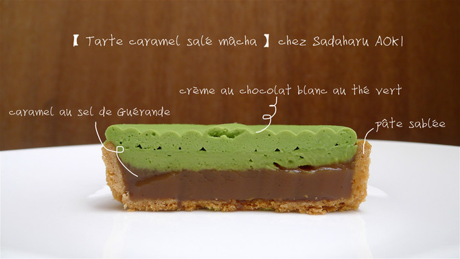
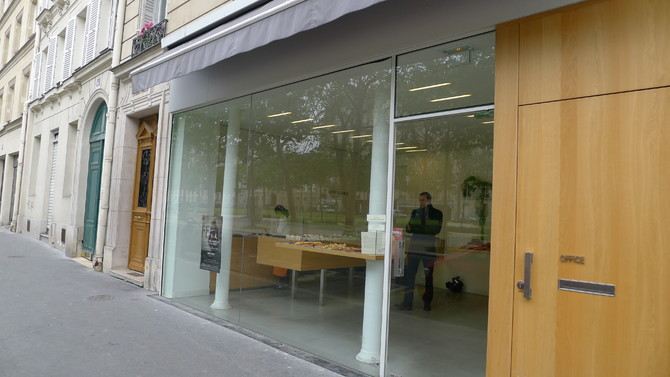
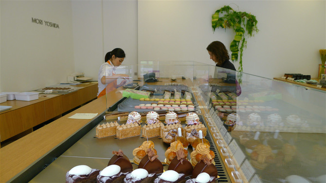
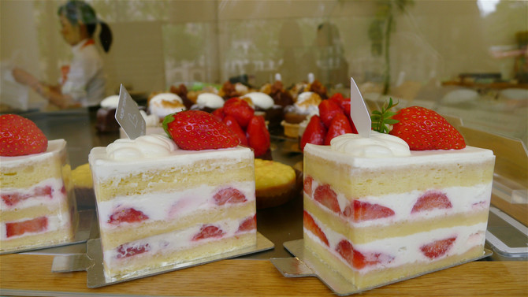

### Desert

[2014年巴黎71家好吃的甜点面包店大集合](http://bbs.qyer.com/thread-965221-1.html).

#### Sadaharu AOKI 人气日本甜点店

[blog source](http://bbs.qyer.com/thread-951229-1.html)

[Website](http://www.sadaharuaoki.com/)

地址：25，rue Perignon, 75015 Paris(多个地址，**老佛爷里有柜台**)

营业时间：周一至周六 11h-19h

#### MORI YOSHIDA 最好吃的日本草莓蛋糕

[blog source](http://bbs.qyer.com/thread-953862-1.html)

去年才开的日风小店，短时间内就获得好评和关注了。这位年轻的日本大叔还真的不简单呢，在日本开店又得了很多奖项，现在在巴黎也能尝到他的作品了，日式草莓蛋糕，香蕉可颂，红茶挞都很惹人眼球。

[Website](http://www.moriyoshida.fr/)

地址：65 avenue de Breteuil 75007 Paris

营业时间：周二至周日 10h-19h15
