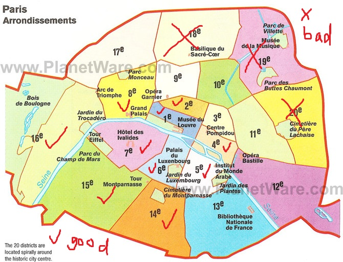

### About accommodation

巴黎实际上是大家俗称的小巴黎，一共有20个区，邮编以75开头，尾数是每个区的数字，如：巴黎一区是75001，二区是75002，以此类推........所以大家很好区分巴黎的区(不懂的，看下面的图)。 

总体来说**以塞纳河为界，北边较乱，南边较安全**。

**1、2、4、5、6、7、8、14、15、16区** only.

**Never** 18, 19, 20.

On the above map, only live in **good** marked area.

---
### Booked Already

##### Hotel Max

http://www.booking.com/hotel/fr/jardindalesia.en-gb.html?aid=355028;sid=8538f2e84217b29faa6d600cbb5795e4;dcid=4;checkin=2014-08-21;checkout=2014-08-26;ucfs=1;pr=70,160;pr_cur_code=GBP;srfid=b940343ea4697cb1e4bc47f79d17a87ccc766b01X1;highlight_room=5064102

**Address**: 34, rue d'Alésia, **14th arr**. - Montparnasse, 75014 Paris, France

Must be cancelled before **18 Aug, 2-14**. [cancel link](http://www.secure-hotel-booking.com/Hotel-MAX/2H3V/cancel?ref=J98GHN)

Price: 665 Eur

Parking: Public parking is possible at a location nearby (reservation is needed) and costs EUR 18 per day.

##### Seven Hotel

http://www.booking.com/hotel/fr/seven.en-gb.html?aid=355028;sid=8538f2e84217b29faa6d600cbb5795e4;dcid=4;checkin=2014-08-21;checkout=2014-08-26;ucfs=1;pr=70,160;pr_cur_code=GBP;srfid=0d7627e7d4cb0011e9a7b481465260d61b41c73eX12;highlight_room=24310701

**Address**: 20 rue Berthollet, **5th arr**. - Quartier Latin, 75005 Paris, France

Must be cancelled before **18 Aug, 2-14**. [cancel link](http://www.secure-hotel-booking.com/Seven-Hotel/2GQ4/cancel?ref=J98G9P)

Price: 876 Eur

Parking: Public parking is possible at a location nearby (reservation is not needed) and costs EUR 3.90 per hour.

##### Ibis Styles Paris Pigalle

Booked twice in official website and bookings.com

http://www.booking.com/hotel/fr/hotelarcantisfrochot.en-gb.html?sid=8538f2e84217b29faa6d600cbb5795e4;dcid=2

[cancel in booking](https://secure.booking.com/myreservations.en.html?bn=149783037;pincode=6372;source=conf_email;pbsource=conf_email_modify)

cancel in official website: login into ibis website using massd.me@gmail.com, then cancel
