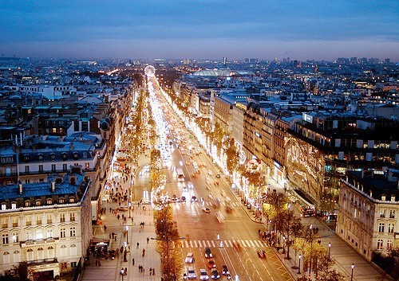

## Itinerary

### Day 1, 2014-08-21, Arriving paris

#### Departure & Arrival

- Eurostar
- **11:31** @ London St Pancras International
- Carriage 4, Seat 11&12
- Arrive at **14:47** @ Paris Gare Du Nord
- Takes 2h16m

#### 5pm, Tour Eiffel 埃菲尔铁塔

埃菲尔铁塔（Eiffel Tower）建成于1889年，为纪念法国革命100周年，是无可争议的巴黎的象征。塔高324米，分三层，各层登塔收费不同。建议傍晚登塔，可同时观赏黄昏和夜景。夜景亮灯还会变化颜色，是拍照的绝佳时机。

开放时间：9:30-23:00，6月中旬至8月底9:00-凌晨0:00
门票：分为乘电梯和爬楼梯两类。可网上预订。电梯顶层 13.1欧，必须在预订的时间到达，过期失效。
价格:8欧元 (乘坐电梯到达第二层)
价格:14欧元 (乘坐电梯到达第顶层)
价格:4.5欧元 (走楼梯到达第二层)

门票预订官网：进入官网：http://ticket.toureiffel.fr/，如果是法语界面，点右上角英国旗标志可以切换为英语。（需要开通网银，订票成功后将确认信息打印出来，到埃菲尔铁塔下出示即可）

### Day 2, 2014-08-22, Disney Land

### Day 3, 2014-08-23, 凯旋门，香街，巴黎歌剧院，大皇宫

**Morning rest at hotel**

#### 凯旋门 Arc de triomphe

在戴高乐广场中央，高 50 米，是巴黎的象征之一，周围发散有12条大道。最有名的莫过于被称做世界上最美的散步大道——香榭丽舍。 建于1836年，为纪念法国军队的光荣和胜利，规模超过了罗马君士坦丁凯旋门。

#### 香街 Avenue des Champs-Élysées

雍容华贵的高级商业区，也是全球世界名牌最密集的地方，全长1800米。东起协和广场，西至戴高乐广场（凯旋门），是巴黎大街中心的女王。香榭丽舍位于巴黎中轴线上，西端是凯旋门，顺着延伸线是巴黎的新区La Defense拉德方斯，那里还有个“新凯旋门Grande Arche”，东端则是巴黎最大的协和广场(place de la concorde) ，顺着延伸线则是卡鲁塞尔(carrousel)凯旋门及卢浮宫。 每逢重大节日，凯旋门正顶上会悬挂一面巨大的法国国旗，香榭丽舍街旁的大树上也会装饰上特别的彩灯。国庆阅兵式、环法的最后一程都在香榭丽舍大街上进行。

**如果路上有人和你搭讪，借你护照买LV包，一定走人，别停留**

餐饮: 可以在这里尝试法国小有名气的连锁餐厅Chez Clement

 
#### 巴黎歌剧院 Opéra Garnier

新巴洛克建筑的典范，由建筑家查尔斯·加尼叶（Charles Garnier）设计，由于地基不稳和战争等原因，歌剧院从策划到完成用了近15年，终于在1875年正式揭幕。不幸的是在1896年某次演出中，观众席上方的水晶大吊灯坠落造成了一名妇女死亡。“歌剧魅影”就是以19世纪的巴黎歌剧院为背景，这次事件也被作者改编，成为电影中的著名场面。

现在，**没有演出的白天可以买票参观**，别忘了欣赏中央的支型吊灯，重量超过6吨，掉下来可就不得了了。歌剧院内部奢华夺目，装饰着精美的色彩缤纷的大理石横梁、廊柱和大量的雕像，其中很多是希腊神话中神的肖像。剧院前厅的廊柱间，陈列着很多著名作曲家的半身铜像，如莫扎特和贝多芬。内部有交错的走廊、楼梯井、休息室和平台供人们在演出间隙进行社交活动。

开放时间：10:00-17:00 (有演出的日子10:00-13:00，提前半个小时停止进入) 1月1日，5月1日及一些特殊游行的日子关闭。
门票：9欧 (25岁以下或学生6欧)。

### 大皇宫

### Day 4, 2014-08-24, 凡尔赛宫，Chateau de Versailles
- Open 9:00 - 18:00
- Ticket: castle only 15 euro

### Day 5, 2014-08-25 卢浮宫，巴黎圣母院
- Open 9:00-18:00
- Ticket: 11 euro

### Day 6, 2014-08-26 圣心堂
- if have time go in the morning
- it closes to euro star station
