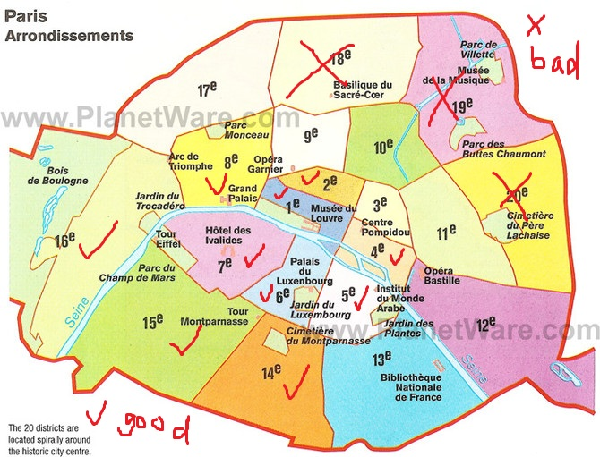

### About accommodation

巴黎实际上是大家俗称的小巴黎，一共有20个区，邮编以75开头，尾数是每个区的数字，如：巴黎一区是75001，二区是75002，以此类推........所以大家很好区分巴黎的区(不懂的，看下面的图)。 

因为巴黎的治安和区分紧密相关。总体来说**以塞纳河为界，北边较乱，南边较安全**。

如果细分的话**巴黎18、19、20区这三个区能不住在这里就不住在这些地方，能不去这三个区，就尽量别去这里。**

如果范围更广一些，大巴黎（严格意义上已经不是巴黎，只是和巴黎临近），如93省，邮编以93开头的省，千万千万千万别去住，因为就算连路过、堵车、等红灯这样短的时间，都可能被砸车抢劫，这样的事情每天都会发生。为了大家的安全，请尽量住在小巴黎1、2、4、5、6、7、8、14、15、16区，或者大巴黎的92省。

### In tour

在旅游景点一定要注意一些拿着牌子，问你会不会英语，让你在纸上签字的人，这种情况下，要么签字的时候被偷东西，要么签完字要付钱。在铁塔、春天百货、老佛爷、巴黎圣母院，这样的人特别多，几乎人人都能碰到，他们一般是三五成群的罗马尼亚人（法国人称为罗姆人），遇到这样的人赶紧掉头走掉，或者装作听不懂走开。

在老佛爷和巴黎春天购物的时候，注意千万不要到附近的自动取款机取现金，因为你取钱时随时都在被人盯着。他们会在你取钱的时候突然出来干扰你，另一个人趁你不注意输入金额拿走你的钱。

### Commute

巴黎的地铁是全世界最发达的地铁网，覆盖所有景点和飞机场、火车站。如果一行多人，或者有熟人带路，或者自己本身很会认路，这样基本上可以只坐地铁。但是如果你是游客，而且人少，不建议乘坐地铁，因为地铁本身就是一个龙蛇混杂的地方，也是一个抢劫、偷盗的高发地点。如果背双肩包出行的游客一定要把包背到前面，千万不要在地铁上玩手机，因为下一秒很可能就被抢了，这样的事情巴黎人已经习以为常了。

**自驾游一定要注意，乘客离开车的时候，贵重物品要随身带走，因为车窗被砸偷东西的事也时有发生。**

### Bad example 1

支持楼主，去年要是有你提醒我就不会丢东西了，巴黎绝对比国内的朋友们想得乱的多。
我就是在RER B线上丢的东西，当时也是刚到巴黎，相当郁闷。
更关键的是法国警察根本不管这些贼，感觉是默视对中国游客的犯罪，所以大家只能自己保护自己啊，谁让咱们的政府不管事呢，这种情况也不跟自己人说一说提个醒，只是为了经济利益想跟法国政府保持好关系。

咱们大家要共享信息，互相帮助。

**建议大家都住在市中心，房间贵点没关系，不差这点钱啊**，来趟法国要玩开心啊，住在市中心去景点也方便。

**晚上不要出门，天黑就回酒店。在酒店里把重要东西放在保险箱里**，不要就放在明面上，丢了东西酒店可不管，而酒店里内鬼也不少啊。

从戴高乐机场出来就坐BUS吧，**别坐RER了，觉得RER挺危险的**，不断有贼上车下车，伺机作案，RER上没有警察也看不着司机，而且法国人很冷漠，基本谁也不管谁，即使车站里的工作人员也不会管你的， 如果丢了东西他们只会告诉你去警察局吧，东西别想找回来。就算你报警了，警察也不会来的，你只能自己去警察局做笔录，警察会明确地告诉你，东西是找不回来的，最后你只能认倒霉了。

巴黎地铁挺发达，但是比较危险，又脏又乱，什么人都有，经常有酒鬼上来乞讨，挺吓人的。

有些景点也挺乱，**圣心堂**那地方就挺乱的，我就差点被一个黑鬼黑了，他是卖什么幸运绳的，拽着我的胳膊就要往上系，系上就管你要20欧，要是不给，一帮黑人就围上来了，因为之前我们在RER上丢了东西，所以后来就开始关注安全信息。当时他都已经拽住了我的手，我高喊NO，NO估计把他吓住了，然后跑开了。后来我继续往上走，看到好多黑鬼在那站着无所事事，就瞪着大眼睛盯着你，估计就是在找猎物，可吓人了。我后来跟着一个旅行团一起走，才感觉好些。看完景点就迅速离开那地方了。大家去这里的时候最好多找一些人，一起去，人多他们就不敢找麻烦了。

听当地的留学生和华人说，巴黎社会治安不好，警察根本管不了贼，他们都是自己保护自己，身上都不敢多带钱，晚上都不敢出门。

总之大家心里要有数啊，巴黎真的挺乱的，一定要注意安全。

### Bad Example 2

简直是血泪史啊，只有来过这里的人，才能知道游客和当地华人的疾苦，我们是天天和黑阿作斗争啊 ! 现在，全世界都知道中国游客有钱，爱带现金，出了事没人管，你让黑阿们怎么能不惦记着咱们。       

B 线是出了名的乱，哪天不发生个把抢劫偷窃事件，回想当年第一次晚上去戴高乐机场送朋友，回来坐B线时，当时一上车就感觉气氛不对，车辆经过93省时，大半夜的，路上也没个路灯，真他妹恐怖啊。
    
法国警察就那样，来的时间长的都习惯了，出了名的没用，唯一的作用就是问路吧。

**圣心教堂，蒙马特高地那边，晚上千万不要一个人去，尤其是女生，那边不算巴黎，简直是非洲。**

### Example 3

个人感觉只要注意些，提高警惕，其实没有想象的那么可怕

这次去不小心订到了18区的ibis，去之前才发现这个区的治安情况，好在地铁站离酒店只有100米做了一番思想斗争还是住下了

天亮的时候感觉跟别处也没什么两样，天黑以后注意不出去游荡就好，第一天晚上回酒店的时候吓得够呛，事后证明大半是自己吓自己...之后三晚也都安然度过

**至于圣心堂，不要从正面的楼梯上下，那边确实盘踞了不少系小绳的黑人，从一侧距离30米的缆车旁边的楼梯走就清净了~另外，圣心堂那条街的纪念品店价格应该是巴黎最便宜的**

### Province 9

九区ok的，老佛爷，春天都在9区，那边小偷挺多，注意下。
