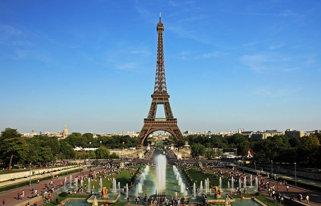
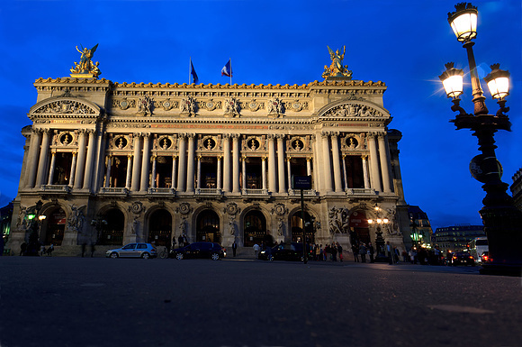

### 巴黎观光攻略（必去景点/行程安排）

[source 1](http://go.360.cn/wp/7508.html)

[source 2](http://www.touropia.com/tourist-attractions-in-paris/)

#### 最值得去的景点

##### 巴黎市中心

埃菲尔铁塔（La Tour Eiffel）

卢浮宫（Musee du Louvre）（远古和古代艺术）

巴黎凯旋门（l'Arc de Triomphe）

巴黎圣母院（Notre-Dame de Paris）

圣心堂（白教堂）（Le Sacre-Cœur）

奥塞美术馆（Musee d'Orsay）（近代艺术）

香榭丽舍大街（Avenue des Champs-Elysees）

巴黎歌剧院（Le Palais Garnier，或又称L'Opera Garnier）

协和广场（Place de la Concorde）

##### 拉丁区

蒙马特高地（Montmartre）

夜生活 红磨坊夜总会（Bal du Moulin Rouge）

##### 巴黎近郊

凡尔赛宫（Chateau de Versailles）

枫丹白露宫（Chateau de Fontainebleau）

#### 全景地图

